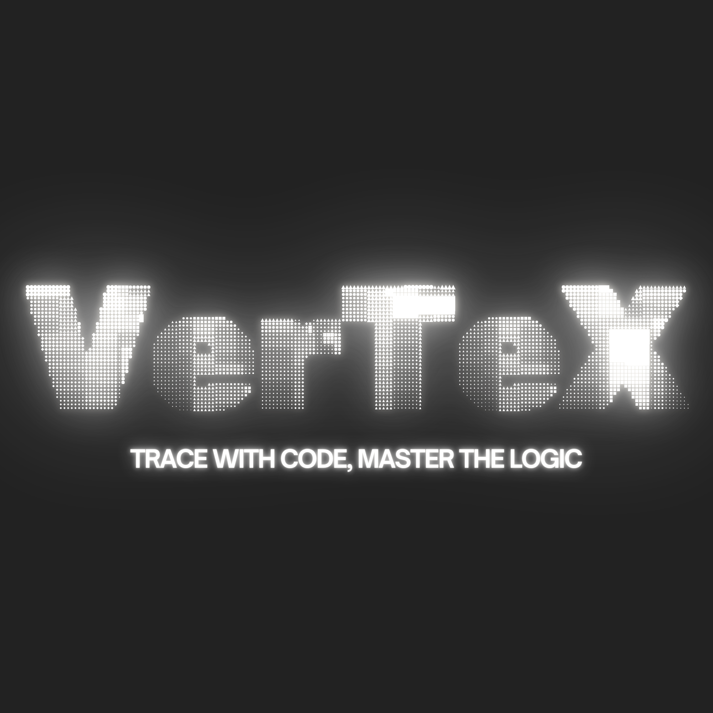

# 🌌 Vertex - The Visual Learning IDE

**Vertex** is a next-generation Integrated Development Environment (IDE) designed to transform the way developers learn and visualize code. Built on top of VS Code's Monaco Editor and enhanced with local AI, Vertex provides a unique "Teacher's Slate" experience where the editor guides you through every character, while a dynamic visual graph traces your logic in real-time.



## ✨ Key Features

### 🖋️ Teacher's Slate (Learning Mode)
The "Teacher's Slate" isn't just an editor; it's a mentor. 
- **Ghost-Text Guidance**: Follow along with predictive ghost text that appears as you type. Learn syntax by doing, not just reading.
- **Smart Completion**: Interactive lessons that ensure you're on the right track character-by-character.
- **Unified Header**: Effortlessly rename files directly on the slate to switch language contexts instantly.

### 🧠 Visual Intelligence (Call Graph)
Static code becomes a living map with Vertex's visual relationship tracing.
- **Dynamic Arrows**: Real-time arrows connect variable usage to their definitions and function calls to their sources.
- **Cross-Language Support**: Intelligent parsing for **Python, JavaScript, C, C++, and Java**.
- **Contextual Hover**: Highlight related logic paths just by moving your cursor.

### 🐚 Vertex Terminal v2.0
A heavy-duty, real-time shell integrated deeply into the browser.
- **Interactive STDIN**: Fully supports interactive programs! Run `input()` in Python or `scanf()` in C and provide input directly in the terminal history.
- **Real-time Streaming**: No more waiting for execution to finish. See output bit-by-bit as it happens.
- **Zero-Config Execution**: Automatically uses your local compilers (gcc, g++, python, node) via a secure local bridge.

### 🧘 Sensei: The Motivational AI
Vertex includes a built-in "Sensei" that follows your cursor.
- **Motivational Feedback**: Instead of dry technical errors, Sensei provides short (10-20 words) motivational quotes and encouragement to keep you focused.
- **Context Aware**: Appears only when you're in an active lesson, keeping your workspace clean during free-form coding.

---

## 🚀 Quick Start

### Prerequisites
- **Node.js**: (v16+)
- **Compilers**: `gcc`, `python3`, `node` should be in your PATH for the terminal to execute code.
- **Ollama**: (Optional) For local AI features like Sensei and the Code Generator.

### Installation

1. **Clone the repository:**
   ```bash
   git clone https://github.com/dev0root6/Vertex-code-IDE.git
   cd Vertex-code-IDE
   ```

2. **Install dependencies:**
   ```bash
   npm install
   ```

3. **Start the environment:**
   Open two terminal windows:
   
   **Terminal 1 (Frontend):**
   ```bash
   npm run dev
   ```
   
   **Terminal 2 (Backend Execution Bridge):**
   ```bash
   node server.js
   ```

Vertex will be running at `http://localhost:5173`.

---

## 🛠️ Architecture

- **Frontend**: React, Vite, Tailwind CSS (optional), and Monaco Editor.
- **Visualization**: `react-xarrows` for the dynamic call graph.
- **Backend**: Express.js server for managing a local `.temp` workspace and spawning sub-processes for code execution.
- **AI Integration**: Ollama API for private, local line-by-line analysis.

## 🤝 Contributing
Contributions are welcome! Whether it's adding new language support to the `CodeVisualizer` or improving terminal streaming, feel free to open a PR.

---
*Built with ❤️ for the next generation of developers.*
